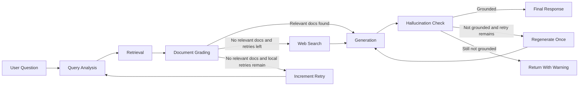

# RAG-Based Technical Documentation Assistant

This project implements a production-oriented RAG assistant for technical documentation using Python, FastAPI, LangGraph, Google Gemini Flash, Gemini embeddings, ChromaDB, Tavily web search fallback, session memory, and a Streamlit frontend.

The repository now includes both the required assignment features and the optional bonus extensions:

- query analysis and classification
- ChromaDB retrieval over technical documentation
- Gemini-based document grading
- conditional LangGraph routing with retry logic
- grounded answer generation with citations
- hallucination checking and one-shot regeneration
- Tavily web search fallback when the local corpus is insufficient
- session-scoped conversation memory for follow-up questions
- FastAPI APIs and a Streamlit chat frontend

## Project Overview

The assistant answers natural-language questions against a documentation corpus. It first tries to ground answers in the indexed documentation. If the corpus cannot answer the question, it can fall back to web search, then runs a hallucination check before returning the response.

The system is designed to:

- prefer local documentation over the open web
- keep routing logic explicit in LangGraph
- preserve backward compatibility for the existing APIs
- expose grounding metadata and source provenance to the client
- support follow-up questions through session-based memory

## Updated Architecture



### Architecture Notes

- `FastAPI` exposes the assistant through HTTP APIs.
- `LangGraph` coordinates the full routing workflow.
- `Gemini Flash` handles query analysis, document grading, generation, and hallucination checking.
- `Gemini Embeddings` powers semantic retrieval.
- `ChromaDB` stores local document chunk embeddings.
- `Tavily` provides the web-search fallback path.
- `SessionStore` keeps per-session chat history on disk under `data/sessions/`.
- `Streamlit` provides a minimal chat interface for follow-up questions and citation review.

## Repository Structure

```text
.
├── app/
│   ├── api/
│   ├── core/
│   ├── generation/
│   ├── grading/
│   ├── graph/
│   ├── ingestion/
│   ├── memory/
│   ├── retrieval/
│   ├── web_search/
│   └── main.py
├── documents/
│   ├── seed/
│   └── seed_sources.json
├── scripts/
│   └── fetch_seed_documents.py
├── streamlit_app.py
├── chroma_db/
├── data/
├── .env.example
├── README.md
└── requirements.txt
```

## Documentation Corpus

The seed corpus is defined in [documents/seed_sources.json](/C:/Users/rohit/Documents/Rag-%20Based%20Doc%20Assistant/documents/seed_sources.json) and includes:

- LangGraph Overview
- LangGraph Graph API Overview
- FastAPI Tutorial
- Pydantic Models
- Chroma Getting Started

The repository stores the source URLs and a fetch-and-ingest script rather than committing third-party documentation snapshots by default.

## Setup

### 1. Create a virtual environment

```powershell
python -m venv .venv
.venv\Scripts\Activate.ps1
```

### 2. Install dependencies

```powershell
pip install -r requirements.txt
```

### 3. Configure environment variables

Recommended:

```powershell
Copy-Item .env.example .env
```

The application reads `.env` first and falls back to `.env.example` for local convenience. Secrets should live in `.env`, not in the tracked example file.

Required or important variables:

- `GEMINI_API_KEY`
- `TAVILY_API_KEY`
- `GENERATION_MODEL`
- `EMBEDDING_MODEL`
- `MAX_RETRIES`
- `MAX_HALLUCINATION_RETRIES`
- `WEB_SEARCH_MAX_RESULTS`

### 4. Ingest the seed corpus

```powershell
python .\scripts\fetch_seed_documents.py
```

### 5. Run FastAPI

```powershell
uvicorn app.main:app --reload
```

Swagger UI:

- [http://127.0.0.1:8000/docs](http://127.0.0.1:8000/docs)

### 6. Run Streamlit

```powershell
python -m streamlit run .\streamlit_app.py
```

## FastAPI Endpoints

### `POST /query`

Submit a question. Supports optional session memory.

Request:

```json
{
  "question": "What is LangGraph?",
  "session_id": "optional-session-id"
}
```

Response shape:

```json
{
  "session_id": "uuid",
  "answer": "LangGraph is ... [1]",
  "sources": [
    {
      "document_name": "LangGraph Overview",
      "source_id": "url-...",
      "source_type": "url",
      "source_kind": "local_document",
      "location": "https://docs.langchain.com/oss/python/langgraph/overview",
      "chunk_id": "chunk-...",
      "chunk_index": 1,
      "similarity_score": 0.70,
      "snippet": "Overview ..."
    }
  ],
  "query_type": "Conceptual",
  "rewritten_query": "LangGraph framework overview ...",
  "retry_count": 0,
  "used_web_search": false,
  "hallucination_check": {
    "grounded": true,
    "confidence_score": 0.95,
    "explanation": "The claims are supported by the retrieved context.",
    "warning": null,
    "regeneration_attempted": false
  },
  "warning": null
}
```

### `POST /ingest`

Supports:

- file uploads
- URL ingestion
- both together

Examples:

```powershell
curl -X POST "http://127.0.0.1:8000/ingest" `
  -F "urls=[\"https://fastapi.tiangolo.com/tutorial/\"]"
```

```powershell
curl -X POST "http://127.0.0.1:8000/ingest" `
  -F "files=@.\documents\my_doc.md"
```

### `GET /documents`

Lists indexed local documents and chunk counts.

### `POST /feedback`

Stores thumbs-up or thumbs-down feedback with an optional comment.

### `POST /session/create`

Creates a new session for follow-up questions.

### `GET /session/{session_id}`

Returns the stored chat history for a session.

### `DELETE /session/{session_id}`

Clears a session and its history.

## Streamlit Frontend

The Streamlit app in [streamlit_app.py](/C:/Users/rohit/Documents/Rag-%20Based%20Doc%20Assistant/streamlit_app.py) provides three main sections:

- Chat Interface
- Source Citations Panel
- Session Information

The UI supports:

- asking questions
- seeing follow-up answers within the same session
- reviewing source citations
- distinguishing `Documentation` vs `Web Search` sources
- viewing hallucination check status and confidence score

## LangGraph State Schema

The workflow state now includes the original required fields plus the bonus-feature fields:

```python
{
    "session_id": str,
    "chat_history": list,
    "user_query": str,
    "rewritten_query": str,
    "query_type": str,
    "retrieved_chunks": list,
    "relevant_chunks": list,
    "web_chunks": list,
    "answer": str,
    "sources": list,
    "retry_count": int,
    "max_retries": int,
    "used_web_search": bool,
    "hallucination_retry_count": int,
    "max_hallucination_retries": int,
    "hallucination_check": dict,
    "warning": str | None
}
```

## Design Decisions

### Query Analysis

The query analysis node uses Gemini to:

- rewrite ambiguous questions
- classify the query
- turn follow-up questions into standalone search queries using session history

### Chunking Strategy

- `chunk_size = 1000`
- `chunk_overlap = 200`
- deterministic character-window chunking

Reasoning:

- preserves enough local technical detail for API explanations and short procedures
- reduces edge loss with overlap
- stays simple and deterministic for local execution

### Embedding Strategy

- model: `gemini-embedding-2`
- query format: `task: question answering | query: ...`
- document format: `title: ... | text: ...`

### Document Grading

The initial implementation graded chunks one by one. The updated version batches chunk grading into a single Gemini call to reduce request count and avoid exhausting free-tier request quotas too quickly.

### Hallucination Check

The hallucination-check node evaluates whether the generated answer is supported by the active context. If not grounded:

1. the graph regenerates once
2. if the answer still fails grounding, it returns the answer with a warning

### Web Search Fallback

If local-document retrieval cannot find relevant context after the configured retry budget, the graph switches to Tavily search. Web results are normalized into the same chunk format used by generation, with `source_kind = "web_search"`.

If web search also fails, the assistant returns:

```text
I couldn't find reliable information in either the documentation corpus or web search.
```

### Conversation Memory

Session memory is stored per session in JSON files under `data/sessions/`. The memory layer is intentionally thin so it can sit on top of the existing architecture without replacing the LangGraph workflow.

## Logging

The application logs:

- routing decisions
- local retry transitions
- web-search usage
- hallucination check outcomes
- transient Gemini retry attempts

## Error Handling

The API returns:

- `400` for invalid user input or bad ingest payloads
- `404` for missing documents or missing sessions
- `503` for temporary upstream model failures
- `500` for configuration problems or unexpected server issues

## Tradeoffs and Limitations

- Gemini free-tier rate limits can still affect rapid repeated queries, even after batching document grading.
- Tavily fallback depends on a valid Tavily key or available keyless access.
- Session memory is file-backed and intended for local/single-instance use, not multi-node deployment.
- Chunking is still character-based rather than heading-aware.
- The hallucination check is itself model-based, so it improves reliability but is not a formal guarantee.

## Verification Summary

Completed locally:

- project compiles successfully
- seed-document ingestion into ChromaDB works
- live local-document query path works with citations and hallucination check
- session creation and session history endpoints work
- follow-up query behavior works on the live path when Gemini quota allows
- deterministic smoke tests confirmed:
  - web-search routing
  - hallucination-triggered regeneration

Observed during live testing:

- the provided Gemini key is functional but subject to free-tier `429` and `503` limits
- the provided Tavily key returned `401 Unauthorized`, so web-search generation could not be fully validated against live Tavily in this workspace

## Improvements With More Time

- add automated tests with mocked Gemini and Tavily clients
- move session persistence and feedback storage to SQLite or Postgres
- add semantic or heading-aware chunking
- add reranking before grading
- stream responses to the frontend
- support deleting or refreshing individual ingested sources

## Local Execution Checklist

1. Put valid keys in `.env`.
2. Run `pip install -r requirements.txt`.
3. Run `python .\scripts\fetch_seed_documents.py`.
4. Start FastAPI with `uvicorn app.main:app --reload`.
5. Optionally start Streamlit with `python -m streamlit run .\streamlit_app.py`.
