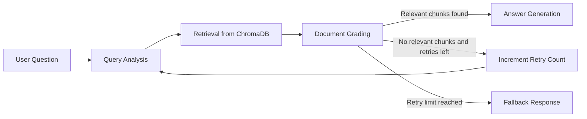

# RAG-Based Technical Documentation Assistant

This project implements a Retrieval-Augmented Generation (RAG) assistant for technical documentation using Python, FastAPI, LangGraph, Google Gemini Flash, Gemini embeddings, and ChromaDB.

The assistant:

- accepts natural language questions
- rewrites and classifies each query before retrieval
- retrieves top-K documentation chunks from ChromaDB
- grades retrieved chunks for relevance with Gemini
- retries retrieval through a LangGraph conditional loop when nothing relevant is found
- generates grounded answers with citations
- exposes the workflow through FastAPI endpoints

## Project Overview

The repository is built around a self-corrective LangGraph workflow:

1. `Query Analysis` rewrites the question for better retrieval and classifies it as `Conceptual`, `How-to`, `Troubleshooting`, or `API Reference`.
2. `Retrieval` embeds the rewritten query and searches ChromaDB for the most similar chunks.
3. `Document Grading` evaluates each chunk with Gemini and keeps only relevant chunks.
4. `Generation` produces an answer grounded only in the relevant chunks and cites sources inline.
5. If no relevant chunks are found, the graph follows a conditional retry path until `MAX_RETRIES` is reached.

## Architecture



### Architecture Notes

- `FastAPI` handles API validation and HTTP responses.
- `LangGraph` manages state, routing, and retry logic.
- `Google Gemini Flash` handles query rewriting, relevance grading, and answer generation.
- `Gemini Embeddings` powers semantic search.
- `ChromaDB` persists chunk embeddings locally under `./chroma_db`.
- `DocumentRegistry` stores indexed document metadata in `./data/indexed_documents.json`.

## Repository Structure

```text
.
├── app/
│   ├── api/
│   ├── core/
│   ├── generation/
│   ├── grading/
│   ├── graph/
│   ├── ingestion/
│   ├── retrieval/
│   └── main.py
├── documents/
│   ├── seed/
│   └── seed_sources.json
├── scripts/
│   └── fetch_seed_documents.py
├── chroma_db/
├── data/
├── .env.example
├── README.md
└── requirements.txt
```

## Documentation Corpus

The project ships with seed URLs and a fetch script instead of committing vendor documentation directly.

Seed sources:

- LangGraph Overview
- LangGraph Graph API Overview
- FastAPI Tutorial
- Pydantic Models
- Chroma Getting Started

These URLs live in [documents/seed_sources.json](/C:/Users/rohit/Documents/Rag-%20Based%20Doc%20Assistant/documents/seed_sources.json).

## Setup Instructions

### 1. Create and activate a virtual environment

```powershell
python -m venv .venv
.venv\Scripts\Activate.ps1
```

### 2. Install dependencies

```powershell
pip install -r requirements.txt
```

### 3. Configure environment variables

Copy `.env.example` to `.env` and set your Gemini API key:

```powershell
Copy-Item .env.example .env
```

Required variable:

- `GEMINI_API_KEY`

### 4. Seed the corpus

This downloads the configured documentation pages, stores plain-text snapshots in `documents/seed/`, and ingests them into ChromaDB.

```powershell
python .\scripts\fetch_seed_documents.py
```

### 5. Run the API

```powershell
uvicorn app.main:app --reload
```

Open Swagger UI at [http://127.0.0.1:8000/docs](http://127.0.0.1:8000/docs).

## FastAPI Endpoints

### `POST /query`

Submit a natural language question.

Request:

```json
{
  "question": "What is LangGraph and when should I use it?"
}
```

Response:

```json
{
  "answer": "LangGraph is a low-level orchestration framework for stateful, long-running agents [1][2].",
  "sources": [
    {
      "document_name": "LangGraph Overview",
      "source_id": "url-...",
      "source_type": "url",
      "location": "https://docs.langchain.com/oss/python/langgraph/overview",
      "chunk_id": "chunk-...",
      "chunk_index": 0,
      "similarity_score": 0.82
    }
  ],
  "query_type": "Conceptual",
  "rewritten_query": "LangGraph overview purpose stateful orchestration framework long-running agents",
  "retry_count": 0
}
```

### `POST /ingest`

Supports file uploads, URL ingestion, or both.

`multipart/form-data` fields:

- `files`: one or more `.md`, `.txt`, or `.html` files
- `urls`: a JSON array string or newline-separated URLs

Example with URLs:

```powershell
curl -X POST "http://127.0.0.1:8000/ingest" `
  -F "urls=[\"https://fastapi.tiangolo.com/tutorial/\"]"
```

Example with a file:

```powershell
curl -X POST "http://127.0.0.1:8000/ingest" `
  -F "files=@.\documents\my_doc.md"
```

### `GET /documents`

Lists all indexed documents and chunk counts.

### `POST /feedback`

Stores thumbs-up or thumbs-down feedback plus an optional comment.

Request:

```json
{
  "rating": "up",
  "comment": "Helpful answer",
  "question": "What is LangGraph?"
}
```

## LangGraph State Schema

The workflow tracks the required evaluation fields:

```python
{
    "user_query": str,
    "rewritten_query": str,
    "query_type": str,
    "retrieved_chunks": list,
    "relevant_chunks": list,
    "answer": str,
    "sources": list,
    "retry_count": int,
    "max_retries": int
}
```

## Design Decisions

### Why direct Gemini SDK instead of a higher-level wrapper

I used the official `google-genai` SDK for both generation and embeddings to keep the Gemini integration explicit and aligned with the selected stack.

### Chunking Strategy

- `chunk_size = 1000`
- `chunk_overlap = 200`
- Strategy: deterministic character-window chunking with overlap

Reasoning:

- 1000 characters is large enough to preserve local technical context such as parameter explanations and short procedures.
- 200-character overlap reduces boundary loss when an answer spans adjacent chunks.
- The deterministic strategy is simple, explainable, and stable for local execution.

### Embedding Strategy

- Embedding model: `gemini-embedding-2`
- Query format: `task: question answering | query: ...`
- Document format: `title: ... | text: ...`

This follows Google's current recommendation for asymmetric retrieval workflows using Gemini embeddings.

### Retrieval and Grading

- Top-K retrieval defaults to `5`
- Every retrieved chunk is graded individually by Gemini as `relevant` or `irrelevant`
- Only relevant chunks are passed to answer generation

### Retry Logic

- `MAX_RETRIES = 2`
- If all chunks are graded irrelevant, the graph increments `retry_count` and loops back to `Query Analysis`
- If retries are exhausted, the assistant returns:

```text
I don't know based on the available documentation.
```

## Error Handling and Validation

The API includes:

- Pydantic validation for request bodies
- `400` for missing question, missing ingest inputs, empty uploads, and unsupported file types
- `404` when no documents have been indexed yet
- `500` for unexpected runtime failures

## Thought Process

The implementation favors clarity and rubric coverage over framework-heavy abstraction. The core goal was to make each evaluation criterion visible in the codebase:

- explicit LangGraph nodes
- explicit conditional routing
- explicit retry state
- explicit ingestion pipeline
- explicit source tracking and citations

## Assumptions Made

- The assistant runs locally with network access when ingesting URLs.
- Gemini API credentials are provided through `.env`.
- A small documentation corpus is acceptable for the initial version.

## Tradeoffs

- Chunking is character-based rather than semantic or heading-aware to keep behavior predictable.
- Relevance grading is done sequentially per chunk, which is simpler but slower than batch grading.
- Feedback is stored in a local JSONL file instead of a database.

## Improvements With More Time

- add heading-aware chunking and HTML-to-Markdown normalization
- store conversation analytics and feedback in SQLite or Postgres
- add automated tests with mocked Gemini responses
- add reranking before the grading step
- support incremental delete/update operations for documents
- add streaming responses for long answers

## Local Execution Checklist

1. Set `GEMINI_API_KEY` in `.env`.
2. Install dependencies with `pip install -r requirements.txt`.
3. Run `python .\scripts\fetch_seed_documents.py`.
4. Start FastAPI with `uvicorn app.main:app --reload`.
5. Test endpoints in Swagger UI or with `curl`.
